# Supermarket Chain Management API 
[](https://github.com/jonathanAguirre1999/API-REST-supermarket-chain/actions/workflows/workflow.yml)
[](https://sonarcloud.io/summary/new_code?id=jonathanAguirre1999_API-REST-supermarket-chain)
[](https://sonarcloud.io/summary/new_code?id=jonathanAguirre1999_API-REST-supermarket-chain)
[](https://sonarcloud.io/summary/new_code?id=jonathanAguirre1999_API-REST-supermarket-chain)
[](https://sonarcloud.io/summary/new_code?id=jonathanAguirre1999_API-REST-supermarket-chain)

    
### Backend API for Retail Logistics

REST API built with **Java** and **Spring Boot** for managing supermarket ecosystems, branches, inventory, and sales transactions.

This system demonstrates the implementation of best practices in software engineering standards, advanced persistence patterns, clean architecture, request validation, error handling, and automated testing.

---

## Architectural Core & Design Patterns

The system is built upon **Clean Architecture** and **Layered Architecture** paradigms, enforcing separation of concerns and the **SOLID** design principles:

* **Domain-Driven Design (DDD) Strategy:** `Sale` is established as an **Aggregate Root**. Sub-entities like `SaleDetails` have their lifecycles strictly managed by the parent root through JPA cascades, eliminating fragmented state synchronization.
* **Decoupled Data Contracts (DTO Pattern):** Clear separation between the persistence layer and the presentation layer. Specialized `RequestDTO` and `ResponseDTO` structures prevent data leakage and decouple API evolution from schema alterations.
* **Dedicated Mapping Layer:** Static mapping components designed with zero business logic. They serve exclusively as data transporters, ensuring computational mutations happen strictly inside the Service layer.
* **Inversion of Control (IoC):** Controller components depend entirely on service abstractions (`interfaces`) rather than concrete implementations, maximizing testability, decoupling, and flexibility for future architectural adjustments.

---

## Key Technical Features

### 1. Transaction-Safe Sales Service (`@Transactional`)
Processing a supermarket invoice requires multi-point data synchronization. The sales processing pipeline guarantees **Atomicity** and **Consistency**:
* **Server-side Price Validation:** The API completely ignores pricing data sent by the client, resolving product prices directly from the database, preventing price-tampering fraud.
* **Atomic Rollbacks:** If a transaction includes 50 items and item 49 fails validation or suffers from stock depletion, the entire operation undergoes an instantaneous rollback, ensuring zero corrupted or "half-saved" data states.
* **Bi-directional Graph Management:** Orchestrates complex relationship linking in-memory prior to execution, ensuring foreign keys are correctly bound without overhead database hits.

### 2. Advanced Persistence Mechanics & Optimization
* **Hibernate Dirty Checking:** Stateful entities retrieved within a transactional context are tracked via Hibernate's session snapshot. State mutations (such as updating stock on sale creation or reversing inventory on logical cancellation) rely on automatic dirty checking, completely avoiding redundant and expensive `.save()` repository operations.
* **Server-Side Pagination & Chunking (`Pageable`):** The product catalog and historical transaction routes completely discard unbounded collections (`List<E>`). Instead, they enforce index-optimized server-side pagination. This protects system memory, allowing the API to efficiently handle large datasets while reducing memory consumption.

<br>

<details>
<summary><b> View Pagination Architecture Output (Postman)</b></summary>
<br>

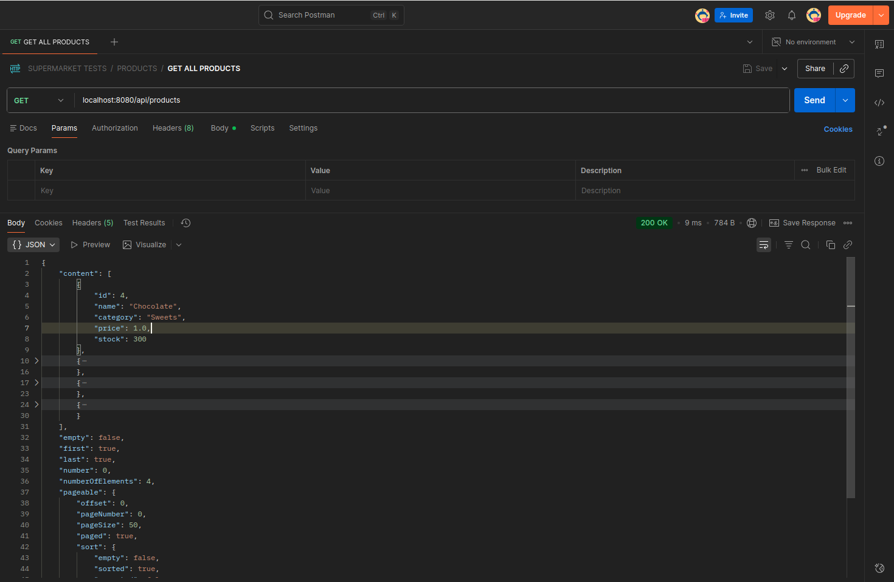
*Paging metadata structure.*
</details>

<br>

* **Advanced Analytical Queries (JPQL):** Deep database-level aggregation using structural joining and grouping (`COUNT`, `SUM`, `GROUP BY`) to extract business metrics (e.g., retrieving the historical top-selling product) with minimal execution overhead.

### 3. Global Exception Mapping
The backend replaces Spring's default Whitelabel HTML views and raw stack traces with standardized JSON error responses through a unified `@RestControllerAdvice`:
* **Predictable Error Contracts:** Clients consistently receive an explicit `ErrorResponseDTO` mapping timestamp, exact HTTP statuses, localized messages, and request URIs.
* **Data Integrity Shield:** Critical exception payloads (such as `NotFoundException` or `NotEnoughStockException`) are translated directly into precise HTTP responses (`404 Not Found`, `409 Conflict`).
* **Structured Validation Array:** Automatically captures failures triggered by Jakarta Validation (`@Valid`). If an incoming payload contains multiple structural errors (e.g., empty strings, negative numbers), the API intercepts them globally and maps them out as a clean array within a `400 Bad Request` state, empowering front-end apps to bind form errors dynamically.

<br>

<details>
<summary><b> View Exception Handling in Responses (Postman)</b></summary>
<br>

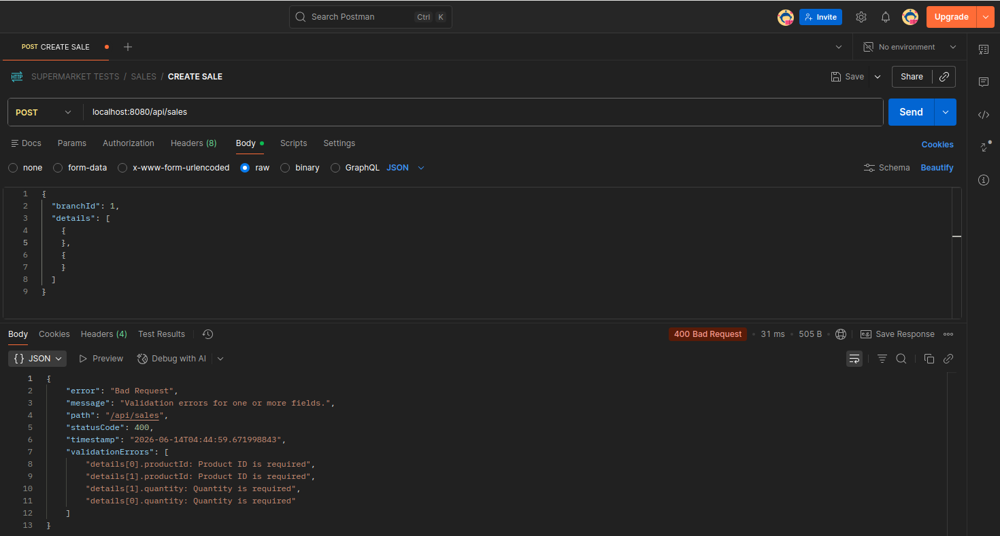
*Response: 400 Bad Request with a detailed error list in JSON format*

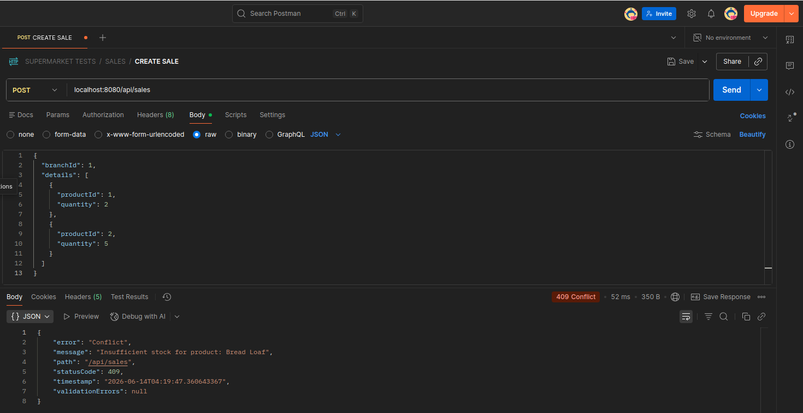
*Response: 409 Conflict with a detailed error message in JSON format*

</details>

<br>

### 4. Interactive OpenAPI 3 / Swagger Documentation
The system integrates an interactive documentation layout using **Springdoc OpenAPI**, customized specifically to present clear integration capabilities to tech recruiters, software architects, and front-end engineers.
* Accessible at: `http://localhost:8080/api/docs` (Configured route).
* Exposes all functional contracts, payload requirements, validation rules, and structural error responses.

<br>

<details>
<summary><b>View Swagger Interactive Documentation Screen</b></summary>
<br>

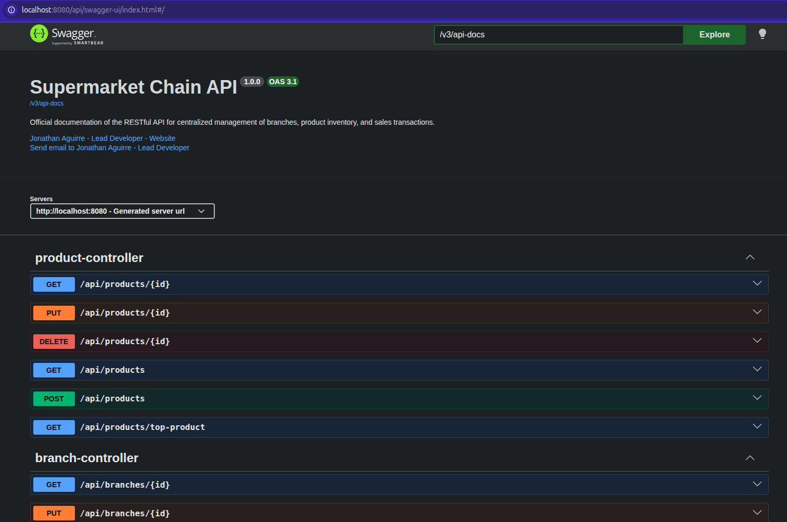
*Swagger interactive documentation included for use through: http://localhost:8080/api/docs once the application is running.*
</details>

<br>

* **NOTE:** A postman collection for testing purposes is available at: `/docs/postman/`
---

## Technology Stack

* **Language:** Java 21+ (LTS)
* **Framework:** Spring Boot (Core, Web, Data JPA)
* **Persistence Provider:** Hibernate ORM
* **Database:** PostgreSQL (Production Profile) / H2 Database (Development Profile)
* **Documentation:** Springdoc OpenAPI UI (v3)
* **Boilerplate Reduction:** Project Lombok
* **Build Automation:** Apache Maven
* **Continuous Integration:** GitHub Actions
* **Testing Framework & Tools:** JUnit 5, Mockito, JaCoCo, SonarLint / SonarQube (SonarCloud)

---

## API Endpoint Architecture

### Branch Management (`/api/branches`)
* `POST /api/branches` - Registers a new corporate branch (`201 Created`).

<br>

<details>
<summary><b>View Create Method Response – Creation of a Branch (Postman)</b></summary>
<br>


*Create Request returns 201 Created and new branch details.*

</details>

<br>

* `GET /api/branches` - Lists all registered branches (`200 OK`).

<br>

<details>
<summary><b>View Get All Branches Method Response (Postman)</b></summary>
<br>

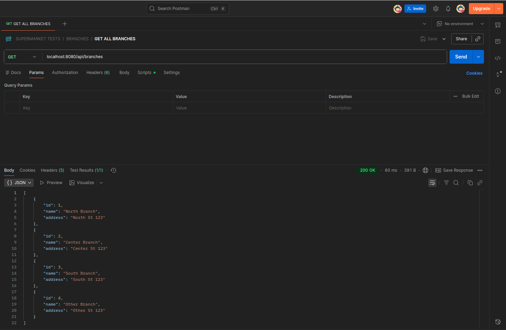
*Get Request returns 200 Ok and a list of branches with their respective details.*

</details>

<br>

* `GET /api/branches/{id}` - Retrieves detailed information of a specific branch (`200 OK`).

<br>

<details>
<summary><b>View Get Branch with ID Method Response (Postman)</b></summary>
<br>

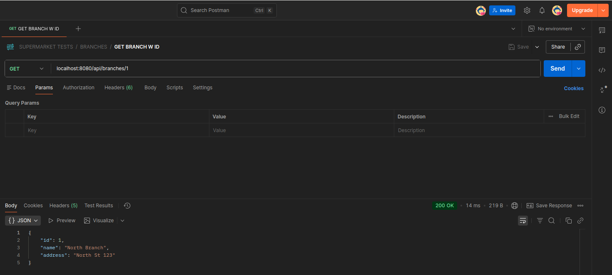
*Get Request returns 200 Ok and branch details when ID is correct.*

</details>

<br>

* `PUT /api/branches/{id}` - Modifies branch parameters (`200 OK`).

<br>

<details>
<summary><b>View Put Method Response - Update Branch (Postman)</b></summary>
<br>

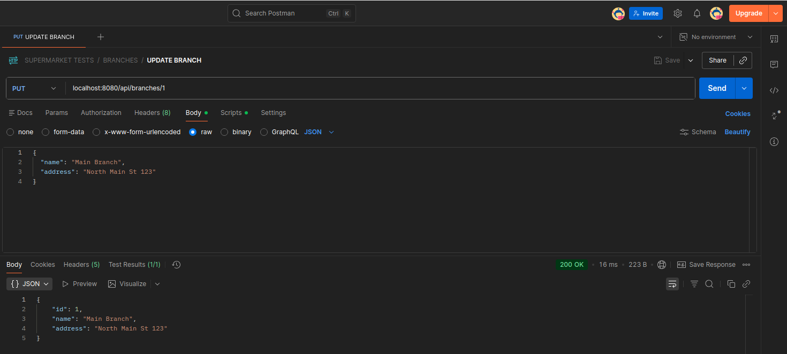
*Put Request returns 200 Ok and updated branch details.*

</details>

<br>

* `DELETE /api/branches/{id}` - Physical soft-deletion of a branch entity (`204 No Content`).

<br>

<details>
<summary><b>View Delete Method Response – Deletion of a branch (Postman)</b></summary>
<br>


*Put Request returns 204 No Content.*

</details>

<br>

### Product Inventory Management (`/api/products`)
* `POST /api/products` - Registers a new inventory product (`201 Created`).

<br>

<details>
<summary><b>View Post Method Response – Creation of a product (Postman)</b></summary>
<br>

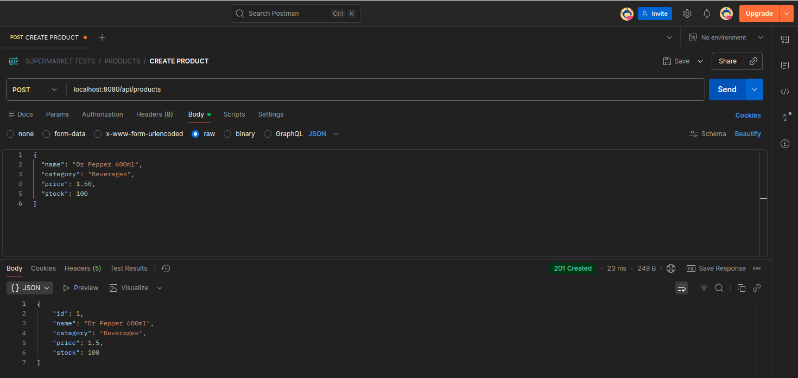
*Post Request returns 201 Created and standard structure of the newly created product.*

</details>

<br>

* `GET /api/products` - Page-chunked extraction of the entire product catalog (`200 OK`). Supports sorting parameters (Default: Name DESC, 50 items/page).

<br>

<details>
<summary><b>View Get All products response (Postman)</b></summary>
<br>


*Get Request returns 200 Ok standard paginated response.*

</details>

<br>

* `GET /api/products/{id}` - Extracts single product details (`200 OK`).

<br>

<details>
<summary><b>View Get Product with ID response (Postman)</b></summary>
<br>

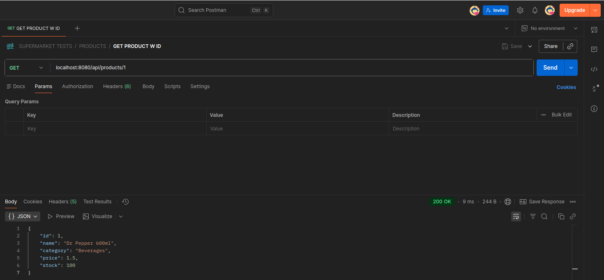
*Get Request returns 200 Ok and standard response structure when ID is correct.*

</details>

<br>

* `GET /api/products/top-seller` - Analytical endpoint resolving the single highest-grossing product historically (`200 OK`).

<br>

<details>
<summary><b>View Get Best-Selling product response (Postman)</b></summary>
<br>

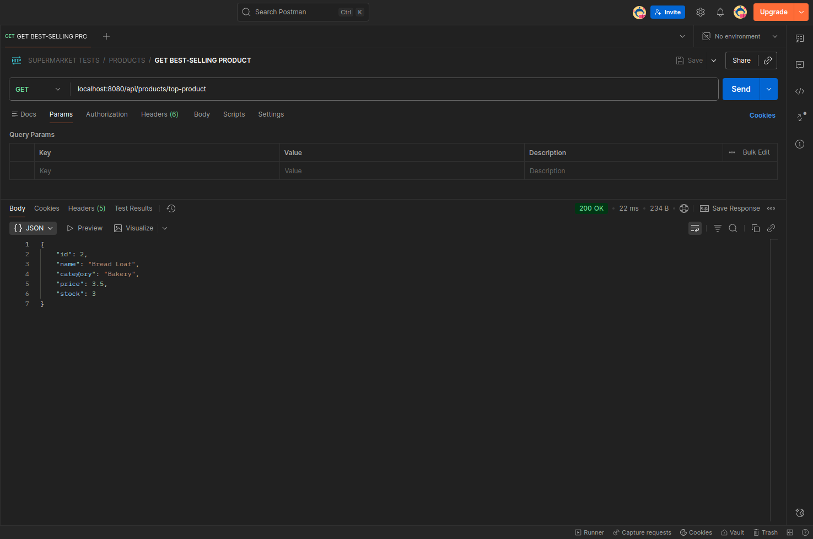
*Get Request returns 200 Ok and best-selling product details.*

</details>

<br>

* `PUT /api/products/{id}` - Modifies product attributes, pricing, or baseline stock (`200 OK`).

<br>

<details>
<summary><b>View Put Method Response - Update product details (Postman)</b></summary>
<br>

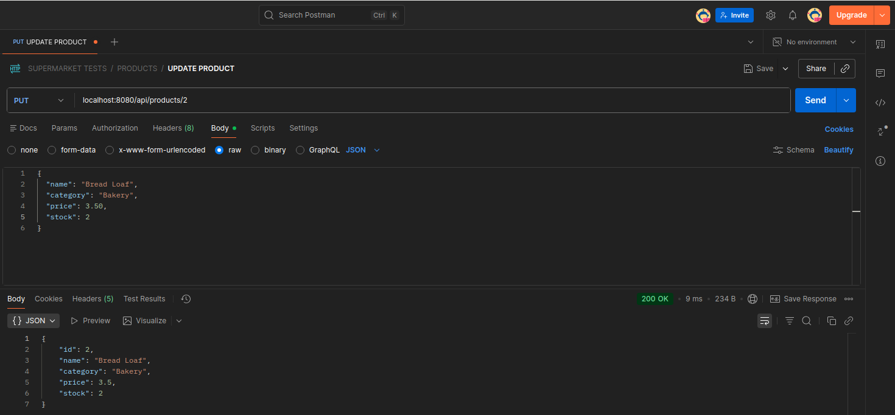
*Put Request returns 200 Ok and updated product details.*

</details>

<br>

* `DELETE /api/products/{id}` - Drops a product from the database catalog (`204 No Content`).

<br>

<details>
<summary><b>View Delete Method Response – Deletion of a product (Postman)</b></summary>
<br>


*Delete Request returns 204 No Content.*

</details>

<br>

### Transactional Sales Operations (`/api/sales`)
* `POST /api/sales` - Initiates, validates, processes, and commits an atomic supermarket sale (`201 Created`). Automatically deducts inventory stock.

<br>

<details>
<summary><b>View Post Method Response – Creation of a sale (Postman)</b></summary>
<br>

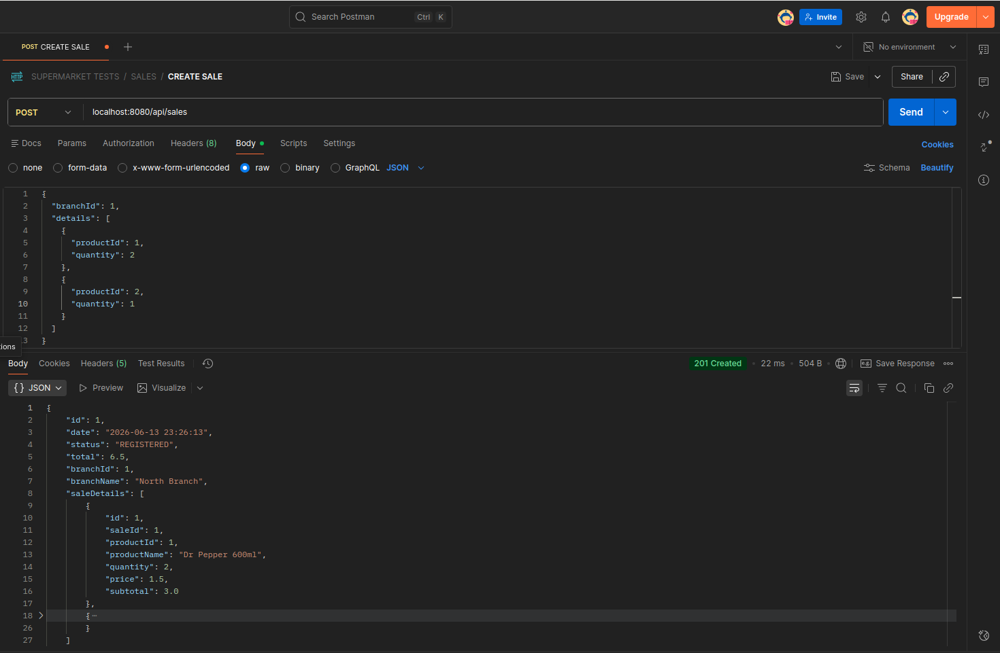
*Response 201 Created showing the nested structure and initial state of the transaction.*
</details>

<br>

* `GET /api/sales` - Paged retrieval of corporate sales history (`200 OK`). Sorted by date (DESC).

<br>

<details>
<summary><b>View Get All Paginated Response (Postman)</b></summary>
<br>

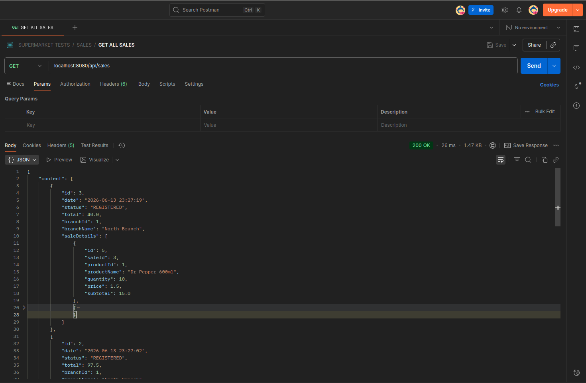
*Get Request returns 200 Ok standard paginated response.*

</details>

<br>

* `GET /api/sales/{id}` - Retrieves structural receipt metadata and nested line-item details of a single sale (`200 OK`).

<br>

<details>
<summary><b>View Get Sales with ID response (Postman)</b></summary>
<br>

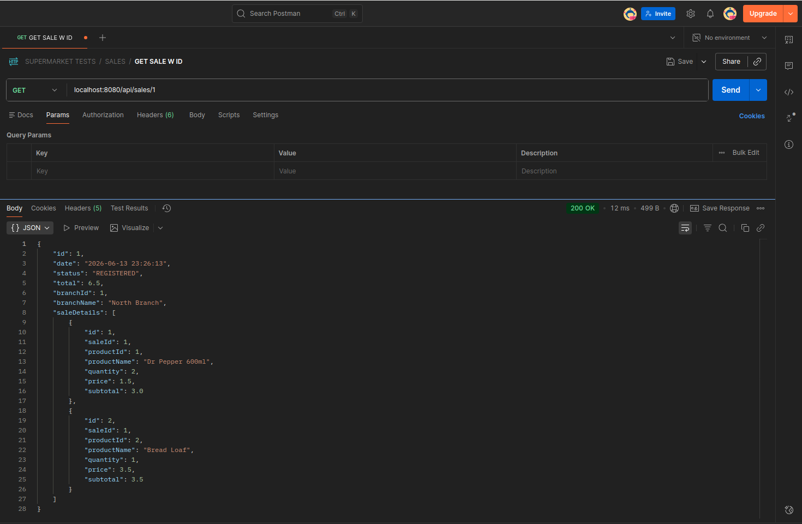
*Get Request returns 200 Ok standard response when ID is correct.*

</details>

<br>

* `GET /api/sales/branch/{id}` - Target extraction of all sales processed by a specific branch (`200 OK`). Enforces full pagination.

<br>

<details>
<summary><b>View Get Sales with Branch ID Response (Postman)</b></summary>
<br>


*Get Request returns 200 Ok standard paginated response.*

</details>

<br>

* `DELETE /api/sales/{id}` - **Logical Sale Cancellation / Annullation** (`204 No Content`). Financial records are locked; the sale status transitions to `CANCELLED`, and Hibernate automatically restores the corresponding line-item quantities back to the product stock.

<br>

<details>
<summary><b>View Logical Annulation Process (Postman)</b></summary>
<br>

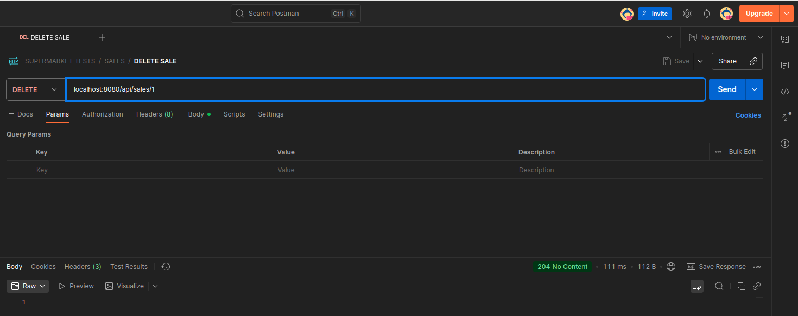
*Delete Request returns 204 No Content standard response.*

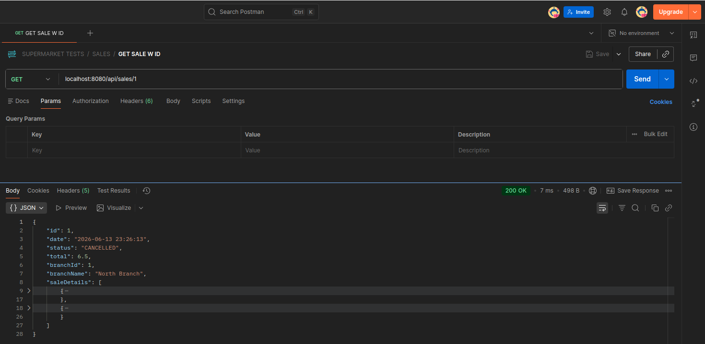
*Entity remains stored in database with CANCELLED status for audit purposes.*
</details>

<br>

* *Note: `PUT /api/sales/{id}` is strictly omitted by architectural design to ensure immutable auditing parameters and prevent transaction fraud.*

---

## Quality Assurance

- Unit testing with JUnit 5
- Mocking with Mockito
- Continuous Integration with GitHub Actions
- Static analysis using SonarCloud
- Code coverage reporting with JaCoCo

---

## Infrastructure & Containerization

The application and its relational database are fully containerized to guarantee environment parity across development, testing, and production instances.

### Multi-Stage Docker Build
The API utilizes a multi-stage Dockerfile to optimize the final artifact:
1. **Builder Stage:** Uses a heavy `maven:3.9.6-eclipse-temurin-21` image to download dependencies securely and compile the `.jar` executable.
2. **Runtime Stage:** Extracts only the compiled `.jar` into an ultra-lightweight `eclipse-temurin:21-jre-alpine` image. This strips away the source code and build tools, drastically reducing the image size and attack surface.

### Execution via Docker Compose
To spin up the entire ecosystem (API + PostgreSQL), ensure the Docker engine is running and execute:

```bash
docker compose up --build -d
```

---

## Upcoming
1. **Security & Access Control:** Enhanced security measures to protect sensitive data and prevent unauthorized access through **Spring Security** and **JWT** authentication.